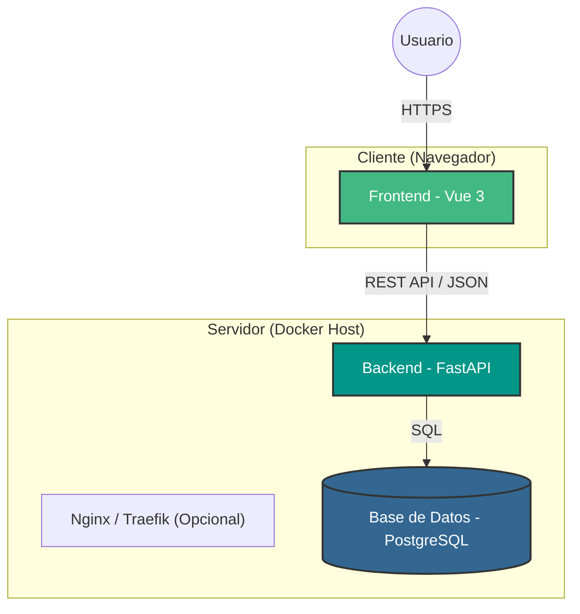
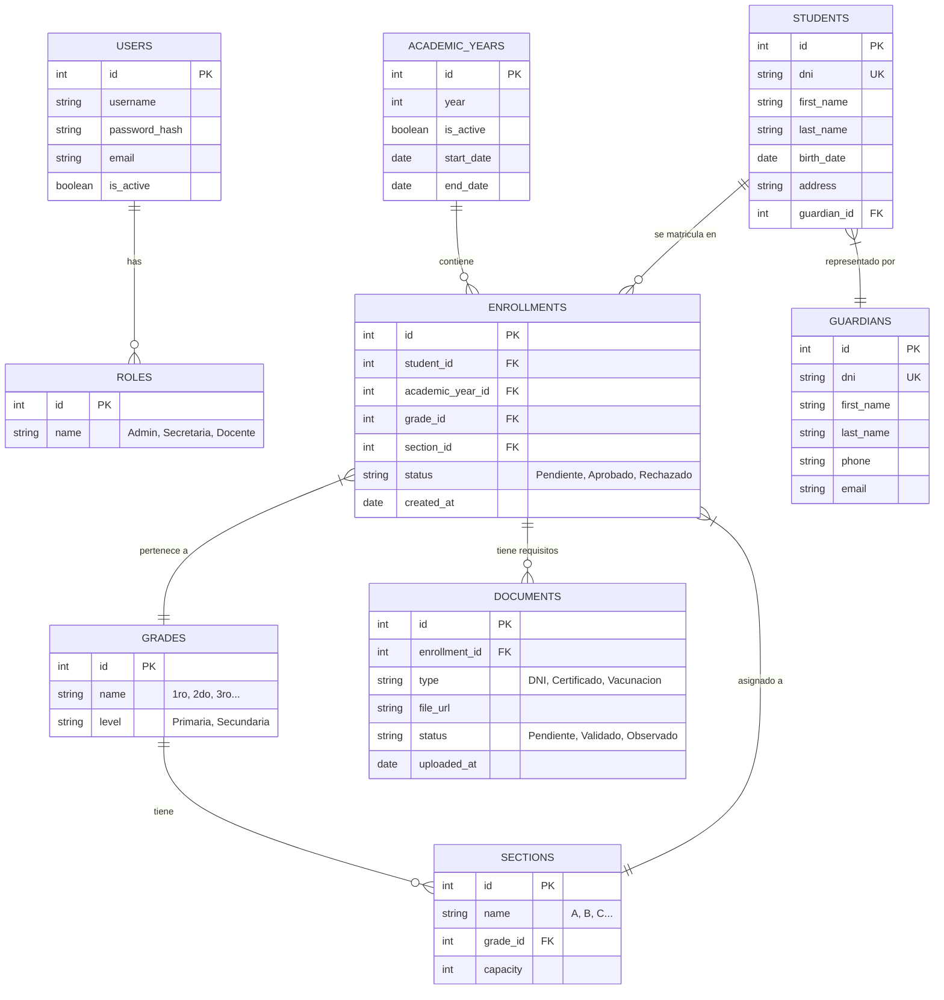
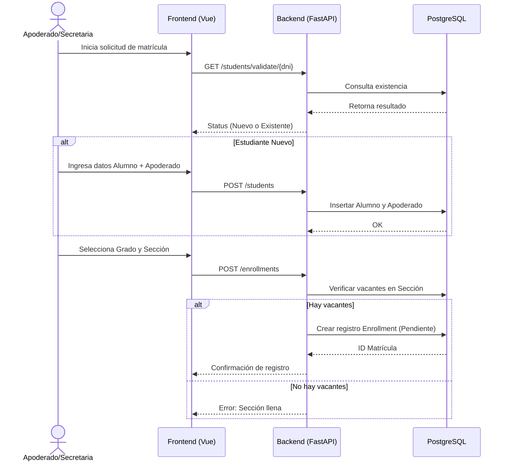

# Sistema de Matrícula - I.E. Mariscal Ramón Castilla

Este proyecto implementa un sistema de matrícula escolar bajo el modelo CaaS (Code as a Service), utilizando contenedores Docker para su fácil despliegue y escalabilidad.

## 1. Arquitectura del Sistema

El sistema está diseñado como una arquitectura de microservicios simplificada, orquestada mediante Docker Compose.

## 2. Diagrama de Entidad-Relación (Modelo de Datos)

A continuación se detalla la estructura preliminar de la base de datos para soportar el proceso de matrícula.

## 3. Flujo de Matrícula (Happy Path)

